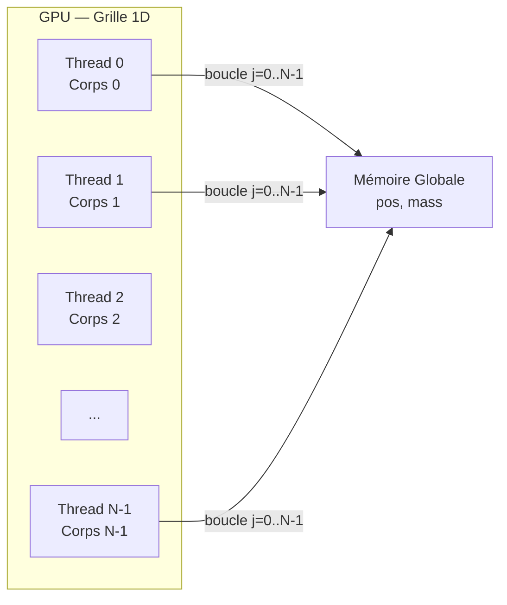
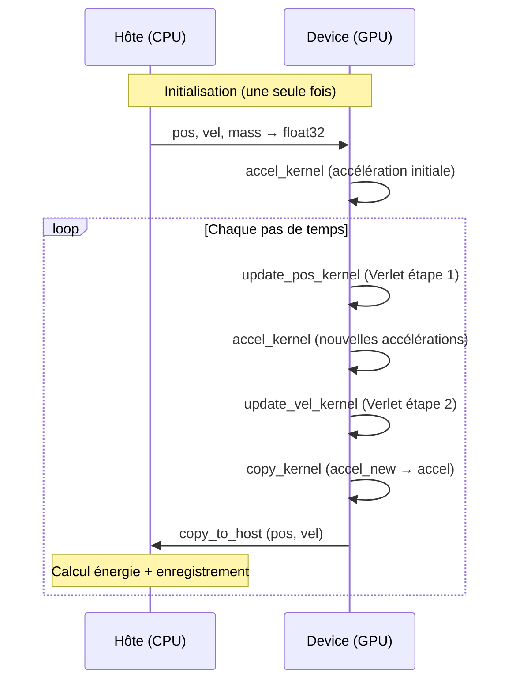

# Implémentation CUDA de la Simulation N-Body

> [!NOTE]
> Ce document décrit l'implémentation GPU naïve *all-pairs* du simulateur N-body gravitationnel, en faisant le lien direct avec le code source [nbody_gpu.py](file:///d:/Downloads/GPU/nbody_gpu.py) et les différences clés par rapport à la version CPU [nbody_script_cpu.py](file:///d:/Downloads/GPU/nbody_script_cpu.py).

---

## 1. Problème et modèle numérique

### 1.1 Objectif
Simuler un système gravitationnel à N corps où **chaque corps interagit avec tous les autres** selon la loi de la gravitation de Newton (complexité *all-pairs*, $O(N^2)$).

### 1.2 Équation de l'accélération

L'accélération du corps $i$ est donnée par :

$$
\mathbf{a}_i = G \sum_{j=1}^{N} m_j \frac{\mathbf{r}_j - \mathbf{r}_i}{\left(\|\mathbf{r}_j - \mathbf{r}_i\|^2 + \text{soft}^2\right)^{3/2}}
$$

Le terme de **softening** ($\text{soft}^2$) empêche les singularités numériques lorsque deux particules se rapprochent trop. Dans le code, cela correspond à :

```python
# nbody_gpu.py, ligne 99
dist_sq = dx * dx + dy * dy + dz * dz + soft * soft
inv_r3  = float32(1.0) / (dist_sq * math.sqrt(dist_sq))
```

### 1.3 Intégration temporelle : Velocity Verlet

Le même schéma que la version CPU est utilisé :

$$
\mathbf{x}_{\text{new}} = \mathbf{x} + \mathbf{v} \, dt + \tfrac{1}{2} \mathbf{a} \, dt^2
$$

$$
\mathbf{v}_{\text{new}} = \mathbf{v} + \tfrac{1}{2}(\mathbf{a} + \mathbf{a}_{\text{new}}) \, dt
$$

Ce schéma est **symplectique** (conserve l'énergie sur le long terme) et de second ordre en précision.

---

## 2. Stratégie de parallélisation : un thread par corps

### 2.1 Le kernel principal [accel_kernel](file:///d:/Downloads/GPU/nbody_gpu.py#67-113)

Le kernel CUDA est lancé avec une grille 1D de blocs de threads, où **chaque thread GPU est responsable d'un seul corps** :

```python
# nbody_gpu.py, lignes 67-112
@cuda.jit
def accel_kernel(pos, mass, G, soft, accel, N):
    i = cuda.grid(1)       # ← index global du thread = identifiant du corps
    if i >= N:
        return

    xi, yi, zi = pos[i, 0], pos[i, 1], pos[i, 2]
    ax, ay, az = float32(0.0), float32(0.0), float32(0.0)

    for j in range(N):                              # ← boucle sur TOUS les corps
        dx = pos[j, 0] - xi
        dy = pos[j, 1] - yi
        dz = pos[j, 2] - zi
        dist_sq = dx*dx + dy*dy + dz*dz + soft*soft
        inv_r3  = float32(1.0) / (dist_sq * math.sqrt(dist_sq))
        ax += G * mass[j, 0] * dx * inv_r3
        ay += G * mass[j, 0] * dy * inv_r3
        az += G * mass[j, 0] * dz * inv_r3

    accel[i, 0], accel[i, 1], accel[i, 2] = ax, ay, az
```

### 2.2 Modèle d'exécution



- **N threads** sont lancés, chacun effectuant **N itérations** dans la boucle interne.
- Complexité totale : $O(N^2)$ — identique à la version CPU vectorisée, mais avec un parallélisme SPMD explicite.

### 2.3 Configuration de la grille CUDA

```python
# nbody_gpu.py, lignes 204-205
threads_per_block = 128
blocks_per_grid   = (N + threads_per_block - 1) // threads_per_block
```

Pour $N = 100$ : `blocks_per_grid = 1` (un seul bloc suffit).
Pour $N = 1024$ : `blocks_per_grid = 8` blocs de 128 threads.

---

## 3. Organisation mémoire et transferts de données

### 3.1 Côté Hôte (CPU)

| Donnée | Type | Usage |
|--------|------|-------|
| [pos](file:///d:/Downloads/GPU/nbody_gpu.py#121-128), [vel](file:///d:/Downloads/GPU/nbody_gpu.py#136-143), `mass` | NumPy `float64` | Conditions initiales, calcul d'énergie |
| `pos_save` | NumPy [(N, 3, N_iter+1)](file:///d:/Downloads/GPU/nbody_gpu.py#274-318) | Historique des positions (animation) |
| `KE_save`, `PE_save` | NumPy [(N_iter+1,)](file:///d:/Downloads/GPU/nbody_gpu.py#274-318) | Énergies cinétique/potentielle |
| `time_arr` | NumPy [(N_iter+1,)](file:///d:/Downloads/GPU/nbody_gpu.py#274-318) | Vecteur temporel |

### 3.2 Côté Device (GPU)

| Donnée | Type | Allocation |
|--------|------|------------|
| `d_pos` | `float32 (N, 3)` | `cuda.to_device(...)` — transfert initial |
| `d_vel` | `float32 (N, 3)` | `cuda.to_device(...)` — transfert initial |
| `d_mass` | `float32 (N, 1)` | `cuda.to_device(...)` — transfert initial |
| `d_accel` | `float32 (N, 3)` | `cuda.device_array(...)` — alloué sur GPU |
| `d_accel_new` | `float32 (N, 3)` | `cuda.device_array(...)` — alloué sur GPU |

```python
# nbody_gpu.py, lignes 195-199 — Transfert initial vers le GPU
d_pos       = cuda.to_device(nbody.pos.astype(np.float32))
d_vel       = cuda.to_device(nbody.vel.astype(np.float32))
d_mass      = cuda.to_device(nbody.mass.astype(np.float32))
d_accel     = cuda.device_array((N, 3), dtype=np.float32)
d_accel_new = cuda.device_array((N, 3), dtype=np.float32)
```

### 3.3 Flux de données par pas de temps



> [!IMPORTANT]
> Le transfert GPU→CPU à chaque itération est un **compromis volontaire** : il permet de réutiliser la fonction [get_E](file:///d:/Downloads/GPU/nbody_script_cpu.py#83-123) du CPU et d'enregistrer les trajectoires pour l'animation, au prix d'un surcoût de communication hôte-device.

---

## 4. Kernels d'intégration et flux de contrôle

### 4.1 Les 4 kernels CUDA

| Kernel | Rôle | Réf. code |
|--------|------|-----------|
| [accel_kernel](file:///d:/Downloads/GPU/nbody_gpu.py#L67-L112) | Calcul $O(N^2)$ des accélérations | L.67-112 |
| [update_pos_kernel](file:///d:/Downloads/GPU/nbody_gpu.py#L121-L127) | Mise à jour des positions (Verlet étape 1) | L.121-127 |
| [update_vel_kernel](file:///d:/Downloads/GPU/nbody_gpu.py#L136-L142) | Mise à jour des vitesses (Verlet étape 2) | L.136-142 |
| [copy_kernel](file:///d:/Downloads/GPU/nbody_gpu.py#L149-L155) | Copie `accel_new → accel` sur le device | L.149-155 |

### 4.2 Boucle temporelle côté hôte

La fonction [run_simulation_gpu](file:///d:/Downloads/GPU/nbody_gpu.py#L174-L267) orchestre la boucle principale :

```
1. Upload données initiales → GPU
2. accel_kernel() → accélération initiale
3. Pour chaque pas de temps :
   ├── update_pos_kernel()     # x += v·dt + ½·a·dt²
   ├── accel_kernel()          # a_new = f(x_new)
   ├── update_vel_kernel()     # v += ½·(a + a_new)·dt
   ├── copy_kernel()           # a = a_new
   ├── cuda.synchronize()      # barrière de synchronisation
   └── copy_to_host()          # → énergie + historique
```

> [!TIP]
> `cuda.synchronize()` garantit que tous les kernels sont terminés avant de lire les résultats. C'est essentiel pour la **correcte mesure du temps** et la **cohérence des données**.

---

## 5. Différences entre les versions CPU et GPU

Les deux fichiers implémentent la **même physique** (gravitation all-pairs + Velocity Verlet), mais la manière dont le calcul est exprimé et exécuté diffère radicalement.

### 5.1 Calcul des accélérations — le cœur du problème

**CPU** ([get_accel](file:///d:/Downloads/GPU/nbody_script_cpu.py#L41-L78)) : approche **vectorisée NumPy** qui construit des matrices $N \times N$ de séparations puis utilise le broadcasting et la multiplication matricielle `@` pour sommer les contributions :

```python
# nbody_script_cpu.py, lignes 61-73 — Vectorisation NumPy
dx, dy, dz = (x.T - x), (y.T - y), (z.T - z)       # matrices N×N
inv_r3 = (dx**2 + dy**2 + dz**2 + soft**2)
inv_r3[inv_r3 > 0] = inv_r3[inv_r3 > 0] ** (-1.5)
ax = G * (dx * inv_r3) @ mass                        # produit matriciel
```

- Crée des **matrices temporaires** $(N \times N)$ en mémoire → empreinte mémoire $O(N^2)$
- Le parallélisme est **implicite** (SIMD interne à NumPy/BLAS)
- Toutes les opérations sont en **`float64`**

**GPU** ([accel_kernel](file:///d:/Downloads/GPU/nbody_gpu.py#L67-L112)) : chaque thread calcule l'accélération d'**un seul corps** avec une boucle scalaire explicite :

```python
# nbody_gpu.py, lignes 78-112 — Kernel CUDA
i = cuda.grid(1)                                     # 1 thread = 1 corps
ax, ay, az = float32(0.0), float32(0.0), float32(0.0)
for j in range(N):                                   # boucle sur tous les corps
    dx = pos[j, 0] - xi
    dist_sq = dx*dx + dy*dy + dz*dz + soft*soft
    inv_r3 = float32(1.0) / (dist_sq * math.sqrt(dist_sq))
    ax += G * mass[j, 0] * dx * inv_r3
```

- **Pas de matrices temporaires** → empreinte mémoire $O(N)$ sur le device
- Le parallélisme est **explicite** (N threads CUDA simultanés)
- Toutes les opérations sont en **`float32`** (plus rapide sur GPU)

### 5.2 Mise à jour des positions et vitesses

**CPU** ([run_simulation](file:///d:/Downloads/GPU/nbody_script_cpu.py#L181-L246)) : les mises à jour Velocity Verlet sont des **opérations array NumPy** en une seule ligne :

```python
# nbody_script_cpu.py, lignes 220-226
nbody.pos = nbody.pos + (nbody.vel * dt) + (0.5 * accel * dt ** 2)
accel_new = get_accel(nbody.pos, nbody.mass, nbody.G, nbody.soft)
nbody.vel = nbody.vel + 0.5 * (accel + accel_new) * dt
```

- Chaque ligne crée un **nouveau tableau** temporaire en mémoire (allocation + copie)
- L'ancien [accel](file:///d:/Downloads/GPU/nbody_script_cpu.py#41-79) est remplacé par simple réassignation Python (`accel = accel_new`)

**GPU** ([run_simulation_gpu](file:///d:/Downloads/GPU/nbody_gpu.py#L174-L267)) : les mises à jour sont des **kernels CUDA distincts** qui modifient les données **in-place** sur le device :

```python
# nbody_gpu.py, lignes 233-250
update_pos_kernel[blocks, threads](d_pos, d_vel, d_accel, dt32, N)      # in-place
accel_kernel[blocks, threads](d_pos, d_mass, G, soft, d_accel_new, N)
update_vel_kernel[blocks, threads](d_vel, d_accel, d_accel_new, dt32, N) # in-place
copy_kernel[blocks, threads](d_accel, d_accel_new, N)                    # a = a_new
```

- **Zéro allocation** pendant la boucle temporelle — pas de tableaux temporaires
- Le [copy_kernel](file:///d:/Downloads/GPU/nbody_gpu.py#149-156) remplace la réassignation Python par une copie élément-par-élément sur le device

### 5.3 Modèle mémoire

| | CPU | GPU |
|--|-----|-----|
| **Localisation** | Tout en RAM hôte | Données actives en VRAM, historique en RAM |
| **Précision** | `float64` partout | `float32` sur device, `float64` pour énergie/historique |
| **Allocation dynamique** | Matrices $N \times N$ temporaires à chaque pas | Aucune pendant la boucle |
| **Transferts** | Aucun (tout sur CPU) | `copy_to_host` à chaque pas pour énergie et trajectoires |

> [!IMPORTANT]
> La version GPU utilise `float32` pour les calculs sur le device. Les GPU grand public ont un **débit float32 bien supérieur** à leur débit float64 (souvent ×32 de différence). La conversion `float32 → float64` ne se fait qu'au moment du `copy_to_host` pour l'énergie.

### 5.4 Optimisations apportées par la version GPU

Bien que l'implémentation soit qualifiée de "naïve" (pas de mémoire partagée, pas de tiling), elle apporte plusieurs **optimisations concrètes** par rapport au code CPU :

| Optimisation | Impact | Détail |
|-------------|--------|--------|
| **Parallélisme massif** | ×100 à ×1000 speedup pour $N$ grand | N threads simultanés au lieu d'un seul flot d'exécution séquentiel |
| **Pas de matrices $N\times N$** | Économie mémoire $O(N^2) \to O(N)$ | La boucle scalaire du kernel évite la construction de matrices de distance |
| **Calcul in-place** | Zéro allocation par pas de temps | Les kernels modifient directement les device arrays |
| **Précision `float32`** | ×2 débit mémoire + calcul | Les GPU grand public offrent un débit FP32 très supérieur au FP64 |
| **Données persistantes sur le device** | Réduit les transferts PCIe | [pos](file:///d:/Downloads/GPU/nbody_gpu.py#121-128), [vel](file:///d:/Downloads/GPU/nbody_gpu.py#136-143), `mass`, [accel](file:///d:/Downloads/GPU/nbody_script_cpu.py#41-79) restent sur le GPU entre les pas |

### 5.5 Pistes d'amélioration futures

> [!WARNING]
> L'implémentation actuelle reste améliorable :
> - **Mémoire partagée + tiling** — charger des tuiles de positions en `__shared__` pour réduire les accès à la mémoire globale (pattern GPU Gems)
> - **Streams CUDA** — recouvrir les transferts `copy_to_host` avec le calcul du pas suivant
> - **Suppression du transfert par pas** — calculer l'énergie directement sur le GPU avec un kernel de réduction
> - **Déplier la boucle** (loop unrolling) — pour mieux exploiter l'ILP des SM

---

## 6. Comparaison CPU vs GPU

| Aspect | [nbody_script_cpu.py](file:///d:/Downloads/GPU/nbody_script_cpu.py) | [nbody_gpu.py](file:///d:/Downloads/GPU/nbody_gpu.py) |
|--------|---------------------|-----------------|
| Calcul des accélérations | NumPy vectorisé (CPU) | Kernel CUDA Numba (GPU) |
| Mise à jour pos/vel | Opérations tableau NumPy | Kernels CUDA dédiés |
| Parallélisme | SIMD implicite (NumPy) | 1 thread CUDA par particule |
| Mémoire | RAM hôte (`float64`) | VRAM GPU (`float32`) |
| Schéma d'intégration | Velocity Verlet | Velocity Verlet (identique) |
| Complexité | $O(N^2)$ (opérations matricielles) | $O(N^2)$ (boucle naïve par thread) |
| Optimisations | Aucune (broadcasting) | Aucune (pas de shared mem, pas de tiling) |

### Quand le GPU est-il avantageux ?

- Pour $N = 100$ : le CPU peut être **plus rapide** en raison du surcoût de lancement des kernels
- Pour $N \geq 1000$ : le GPU **surpasse** largement le CPU grâce à ses milliers de cœurs exécutant les threads en parallèle
- Le **crossover point** dépend du matériel spécifique (GPU vs CPU)

---

## Références

1. NVIDIA GPU Gems 3, Ch. 31 — *Fast N-Body Simulation with CUDA* — [developer.nvidia.com](https://developer.nvidia.com/gpugems/gpugems3/part-v-physics-simulation/chapter-31-fast-n-body-simulation-cuda)
2. 3D Game Engine Programming — *CUDA Case Study: N-Body Simulation* — [3dgep.com](https://www.3dgep.com/cuda-case-study-n-body-simulation/)
3. Numba CUDA Documentation — *Writing CUDA Kernels* — [numba.pydata.org](https://numba.pydata.org/numba-doc/dev/cuda/kernels.html)
4. Repositorio CyT UNLaM — *N-Body Simulation using GP-GPU* — [repositoriocyt.unlam.edu.ar](https://repositoriocyt.unlam.edu.ar/bitstream/123456789/409/1/N-Body%20simulation%20using%20GP-GPU:%20evaluating%20host/device%20memory%20transference%20overhead.pdf)
5. JISOM — *Velocity Verlet Integration* — [web.rau.ro](https://web.rau.ro/websites/jisom/Vol.11%20No.2%20-%202017/JISOM-WI17-A07.pdf)
